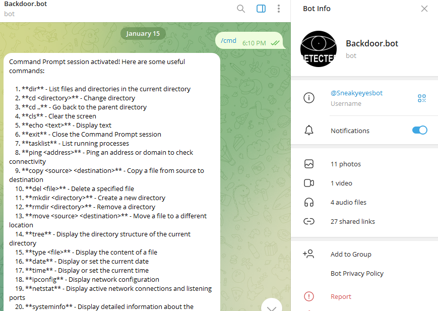
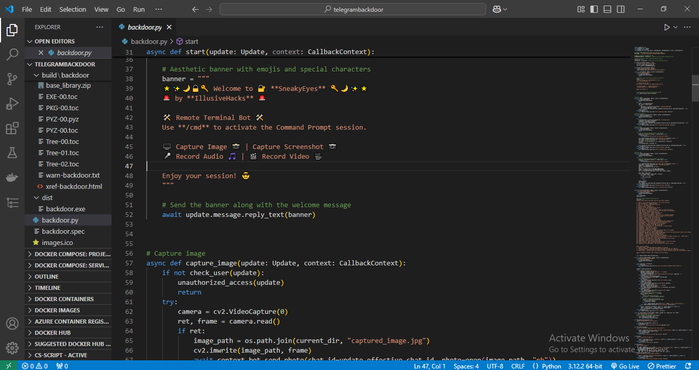

# Telegram Remote Command and Surveillance Bot

## Project Overview

SneakyEyes is a comprehensive remote administration bot for Telegram that enables authorized users to control a Windows-based computer remotely. The bot provides extensive system command execution capabilities, media capture functions, and system information retrieval through a simple Telegram interface.

## Disclaimer

**IMPORTANT**: This software is intended exclusively for legitimate system administration, authorized monitoring, and educational purposes. Users must obtain explicit written permission from the system owner before deployment. Unauthorized access to computer systems violates:
- Computer Fraud and Abuse Act (CFAA) in the United States
- Computer Misuse Act 1990 in the United Kingdom
- Similar legislation in jurisdictions worldwide

The developer assumes no legal liability for misuse of this application. By using this software, you agree that you are solely responsible for compliance with all applicable laws.

## Key Features

### Command Execution System
- Full Command Prompt access with session management
- File system navigation and manipulation
- Process management and monitoring
- Network diagnostics and configuration
- System information gathering
- Environment variable management

### Surveillance Capabilities
- Webcam image capture and transmission
- Screen capture functionality
- Microphone audio recording with configurable duration
- Webcam video recording with configurable duration

### Advanced System Administration
- Application launching and management
- Installed software inventory
- External IP address detection
- System uptime reporting
- User account enumeration
- Wi-Fi network profile extraction
- Service status queries
- System File Checker execution

## Technical Specifications

### System Requirements
- Operating System: Windows 10 or Windows 11
- Python Version: 3.7 or higher
- Hardware Requirements:
  - Webcam (for image/video capture)
  - Microphone (for audio recording)
  - Internet connection

### Python Dependencies

```bash
pip install opencv-python==4.8.1.78
pip install pyautogui==0.9.54
pip install sounddevice==0.4.6
pip install soundfile==0.12.1
pip install python-telegram-bot==20.7
```

### Dependency Purpose Matrix

| Package | Purpose |
|---------|---------|
| opencv-python | Webcam access and video processing |
| pyautogui | Screen capture functionality |
| sounddevice | Microphone audio recording |
| soundfile | Audio file format handling |
| python-telegram-bot | Telegram API integration |

## Installation Guide

### Method 1: Direct Python Execution

1. **Clone or download the project files**
   ```bash
   git clone [repository-url]
   cd telegram-controlled-backdoor-spyware
   ```

2. **Install required dependencies**
   ```bash
   pip install -r requirements.txt
   ```
   Or install individually:
   ```bash
   pip install opencv-python pyautogui sounddevice soundfile python-telegram-bot
   ```

3. **Configure bot credentials**
   - Open the main Python file
   - Locate the configuration section
   - Replace placeholder values with your credentials

### Method 2: Executable Creation

For distribution without Python installation, convert to standalone executable:

**Step 1: Install PyInstaller**
```bash
pip install pyinstaller
```

**Step 2: Create the Executable**
```bash
pyinstaller --noconsole --onefile --icon=images.ico backdoor.py
```

**Flag Explanations:**
- `--noconsole`: Hides console window on execution
- `--onefile`: Creates single executable file
- `--icon=images.ico`: Assigns custom icon to executable

**Step 3: Locate Output**
- Executable will be in the `dist` folder
- Distribute the .exe file to target system

## Telegram Bot Configuration

### Creating Your Bot

1. Open Telegram and search for [@BotFather](https://t.me/BotFather)

2. Send the command:
   ```
   /newbot
   ```

3. Follow prompts to set:
   - Bot name (display name)
   - Bot username (must end with 'bot', e.g., MyAdminBot)

4. Save the token provided by BotFather

### Obtaining Your User ID

1. Search for [@userinfobot](https://t.me/userinfobot) on Telegram

2. Start the bot and send any message

3. The bot will reply with your numeric user ID

### Configuration File Settings

Locate these lines in the code and replace with your values:

```python
# Replace with your Telegram bot token from BotFather
BOT_TOKEN = "1234567890:ABCdefGHIjklMNOpqrsTUVwxyz"

# Replace with your numeric Telegram user ID
AUTHORIZED_USER_ID = 123456789  # No quotes, just numbers
```

**Security Note**: Never share your bot token or user ID publicly. Anyone with these credentials can control your bot.

## Bot Commands Reference

### Session Management

| Command | Description |
|---------|-------------|
| `/start` | Initialize bot and display welcome banner |
| `/cmd` | Activate command prompt session with full command list |
| `/stopcmd` | Deactivate active command prompt session |

### Media Capture Commands

| Command | Syntax | Description |
|---------|--------|-------------|
| `/capture_image` | `/capture_image` | Capture photo from default webcam |
| `/capture_screenshot` | `/capture_screenshot` | Capture screen screenshot |
| `/record_audio` | `/record_audio 15` | Record microphone audio (default 10 seconds) |
| `/record_video` | `/record_video 15` | Record webcam video (default 10 seconds) |

### System Commands (Available in /cmd mode)

#### File System Operations
| Command | Description |
|---------|-------------|
| `dir` | List files and directories |
| `cd <directory>` | Change current directory |
| `cd ..` | Navigate to parent directory |
| `copy <source> <destination>` | Copy files |
| `del <file>` | Delete specified file |
| `mkdir <directory>` | Create new directory |
| `rmdir <directory>` | Remove directory |
| `move <source> <destination>` | Move files |
| `tree` | Display directory structure |
| `type <file>` | Display file contents |

#### Process Management
| Command | Description |
|---------|-------------|
| `tasklist` | List running processes |
| `taskkill /f /im <process>` | Force kill process |

#### Network Commands
| Command | Description |
|---------|-------------|
| `ping <address>` | Test network connectivity |
| `ipconfig` | Display network configuration |
| `netstat` | Show active connections |
| `netsh wlan show profiles` | List saved Wi-Fi networks |

#### System Information
| Command | Description |
|---------|-------------|
| `systeminfo` | Detailed system information |
| `driverquery` | List installed drivers |
| `hostname` | Display computer name |
| `wmic cpu get caption` | CPU information |
| `date` | Display or set system date |
| `time` | Display or set system time |
| `whoami` | Current logged-in user |
| `uptime` | System uptime duration |
| `getip` | External IP address |
| `getenv <variable>` | Environment variable value |
| `gettime` | Current system time |
| `getdate` | Current system date |

#### Advanced Commands
| Command | Description |
|---------|-------------|
| `list_apps` | List all installed applications |
| `open_app <path>` | Launch application |
| `start <url>` | Open URL in browser |
| `chkdsk` | Check disk for errors |
| `sfc /scannow` | Run System File Checker |
| `shutdown` | Shut down computer |
| `restart` | Restart computer |
| `powercfg /batteryreport` | Generate battery report (laptops) |
| `net user` | List user accounts |
| `getservice <service_name>` | Service status query |

## Usage Workflow

### Initial Setup Verification

1. Run the Python script:
   ```bash
   python backdoor.py
   ```

2. Open Telegram and navigate to your bot

3. Send `/start` - Expected response:
   ```
   🌟✨🌙🔒🔑 Welcome to 🔐 SneakyEyes 🔑🌙✨🌟
   🚨 by IllusiveHacks 🚨
   
   🛠️ Remote Terminal Bot 🛠️
   Use /cmd to activate the Command Prompt session.

   🖥️ Capture Image 📸 | Capture Screenshot 📷
   🎤 Record Audio 🎵 | 🎬 Record Video 🎥

   Enjoy your session! 😎
   ```

### Command Session Example

```
User: /cmd
Bot: [Displays 41 command options and instructions]

User: dir
Bot: [Lists current directory contents]

User: cd Documents
Bot: Current Directory: C:\Users\username\Documents

User: ipconfig
Bot: [Displays network configuration]

User: /stopcmd
Bot: Command Prompt session deactivated.
```

### Media Capture Example

```
User: /capture_screenshot
Bot: [Returns screenshot image]

User: /record_audio 5
Bot: Recording audio for 5 seconds...
Bot: [Returns audio file]
```

## Output Examples

### Screenshot Output


### Command Execution Output


## File Structure

```
project/
├── backdoor.py          # Main application file
├── images.ico           # Custom icon for executable
├── requirements.txt     # Python dependencies list
├── LICENSE             # MIT License file
├── output.png          # Screenshot example
├── output2.png         # Command example
└── dist/               # PyInstaller output directory
    └── backdoor.exe    # Standalone executable
```

## Security Features

### Implemented Security Measures
- **User Authentication**: Single authorized user ID restriction
- **Session State Management**: Command mode requires explicit activation
- **No Persistent Storage**: Media files deleted after transmission
- **Input Validation**: Command duration and parameter validation

### Security Limitations (Be Aware)
- Commands execute with logged-in user privileges
- No encryption for command transmission (Telegram provides transport encryption)
- No logging or audit trail
- No rate limiting on command execution

## Troubleshooting Guide

### Common Issues and Solutions

| Problem | Likely Cause | Solution |
|---------|--------------|----------|
| Bot doesn't respond | Invalid BOT_TOKEN | Regenerate token from BotFather and update code |
| "Unauthorized access denied" | Wrong USER_ID | Verify ID using @userinfobot |
| Camera capture fails | Webcam in use or disconnected | Close other camera apps, check device manager |
| Audio recording fails | Microphone permissions | Check Windows privacy settings for microphone |
| Video recording fails | Codec issues | Install appropriate video codecs |
| Command not recognized | Session inactive | Send `/cmd` before entering commands |
| Long output truncated | Telegram message limit | Bot automatically chunks responses |

### Error Message Reference

| Error Message | Meaning |
|---------------|---------|
| `Error: 'path' is not a valid directory` | Specified directory doesn't exist |
| `Invalid duration: must be positive integer` | Use whole numbers only (e.g., 10, not 10.5 or -5) |
| `Permission denied` | Insufficient system privileges for operation |
| `Command not found` | Typo or command not in Windows PATH |

## Testing Procedure

Before deploying to a remote system, test all functionality on your local machine:

1. **Authentication Test**
   ```
   Send /start from authorized ID → Receive welcome banner
   Send /start from different ID → Receive "Unauthorized access denied"
   ```

2. **Command Session Test**
   ```
   /cmd → Receive command list
   dir → Receive directory listing
   /stopcmd → Receive deactivation confirmation
   ```

3. **Media Capture Tests**
   ```
   /capture_image → Receive photo
   /capture_screenshot → Receive screenshot
   /record_audio 3 → Receive audio file
   /record_video 3 → Receive video file
   ```

## Deployment Instructions

### For Target System Deployment

1. Verify target runs Windows 10 or 11

2. Transfer the executable or Python files to target system

3. Ensure no conflicting security software blocks execution

4. Run `backdoor.exe` (no installation required)

5. Verify bot responds to commands from Telegram

6. For persistent access, consider adding to Startup folder:
   ```
   %APPDATA%\Microsoft\Windows\Start Menu\Programs\Startup
   ```

## Legal and Ethical Guidelines

### Permitted Use Cases
- Monitoring your own devices
- Authorized parental control systems
- Corporate endpoint management with employee consent
- Educational cybersecurity training in controlled environments

### Prohibited Use Cases
- Monitoring without explicit consent
- Espionage or competitive intelligence
- Stalking or harassment
- Any violation of computer crime laws

## License

This project is licensed under the MIT License - see the LICENSE file for details.

MIT License grants:
- Free use, modification, and distribution
- No warranty or liability
- Commercial use permitted
- Attribution required

## Support and Contact

For technical questions or issues:

- **Telegram**: @IllusiveHacks
- **Email**: williamkitungo@gmail.com

## Version History

| Version | Date | Updates |
|---------|------|---------|
| 1.0 | Current | Initial release with full feature set |

## Acknowledgments

- Python Telegram Bot library developers
- OpenCV community
- All open-source dependencies used in this project

## Final Notes

**Important Reminders:**
- Keep your bot token and user ID secure
- Test thoroughly before remote deployment
- Comply with all applicable laws and regulations
- Use responsibly and ethically

---

*This documentation is provided as-is without any warranties. Users assume all responsibility for deployment and use.*
